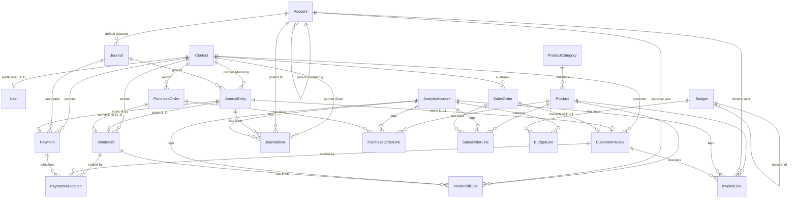

# Entity Relationship Diagram (ERD)

> The relational model for Urban Furniture. Source of truth is `prisma/schema.prisma`;
> DB-level guarantees are in `db/constraints.sql`; invariants/transactions/rationale in
> `docs/database-design.md`. **Design center: a single ledger** (`JournalEntry` +
> `JournalItem`) that every document posts into — reports derive from it.

## 1. Diagram (relationships)

`NumberSequence` is a standalone helper (no FKs): it issues concurrency-safe document numbers.

## 2. Entity catalog

Legend: **PK** all `id` (uuid). Money `Decimal(14,2)`, quantity `Decimal(14,3)`.
Archived = soft-delete flag (never hard-delete referenced masters).

### Identity & access
| Entity | Purpose | Key FKs | Notable constraints / indexes | Lifecycle |
|---|---|---|---|---|
| **User** | Auth + RBAC principal | `contactId?→Contact` (unique, portal link) | `email` unique; idx `role` | isActive toggle |
| **Contact** | Customer/vendor partner | — | `email` unique; `type` default BOTH; idx type, isArchived | archivable |

### Products
| Entity | Purpose | Key FKs | Constraints / indexes | Lifecycle |
|---|---|---|---|---|
| **ProductCategory** | Classify products | — | `name` unique | — |
| **Product** | Goods/Service/Combo sold & bought | `categoryId?→ProductCategory` | prices ≥ 0 (CHECK); idx category,type,isArchived | archivable |

### Chart of Accounts & Journals
| Entity | Purpose | Key FKs | Constraints / indexes | Lifecycle |
|---|---|---|---|---|
| **Account** (CoA) | Classify every posting | `parentId?→Account` (hierarchy) | `code`,`name` unique; idx type,parent | archivable; **pre-seeded** |
| **Journal** | Group entries; supply default account | `defaultAccountId→Account` | `name` unique; idx type | **pre-seeded** |

### Ledger (the heart)
| Entity | Purpose | Key FKs | Constraints / indexes | Lifecycle |
|---|---|---|---|---|
| **JournalEntry** | One accounting record | `journalId→Journal`, `partnerId?→Contact` | `number` unique; `amount≥0`; idx journal,date,state,partner,(sourceType,sourceId) | DRAFT→POSTED→(CANCELLED); **immutable once POSTED** |
| **JournalItem** | Debit/credit line | `entryId→JournalEntry` (cascade), `accountId→Account`, `partnerId?→Contact`, `analyticAccountId?→AnalyticAccount` | INV-2 CHECK (debit XOR credit, both ≥0, non-zero); idx entry,account,partner,analytic | dies with entry |

### Analytic & budget
| Entity | Purpose | Key FKs | Constraints / indexes | Lifecycle |
|---|---|---|---|---|
| **AnalyticAccount** | Cost/revenue marker for budgets | — | `name` unique; idx type | archivable |
| **Budget** | Planned amounts for a period | `revisionOfId?→Budget`, `responsibleId?→User` | period_end ≥ period_start (CHECK); idx state,period | DRAFT→CONFIRMED→REVISED→CANCELLED |
| **BudgetLine** | Planned amount per analytic | `budgetId→Budget` (cascade), `analyticAccountId→AnalyticAccount` | committed ≥ 0; unique(budget,analytic) | dies with budget |

### Purchase (commercial)
| Entity | Purpose | Key FKs | Constraints / indexes | Lifecycle |
|---|---|---|---|---|
| **PurchaseOrder** | Buying doc (no accounting) | `vendorId→Contact` | `number` unique; idx vendor,state,date | DRAFT→CONFIRMED |
| **PurchaseOrderLine** | PO line | `orderId→PO` (cascade), `productId→Product`, `analyticAccountId?` | qty>0, price≥0 (CHECK) | dies with PO |
| **VendorBill** | Payable doc (posts accounting) | `vendorId→Contact`, `purchaseOrderId?→PO` (unique), `journalEntryId?→JournalEntry` (unique) | `number` unique; amount/status CHECKs; idx vendor,state,paymentStatus,date | DRAFT→CONFIRMED; NOT_PAID→PARTIAL→PAID |
| **VendorBillLine** | Bill line + expense account | `billId→Bill` (cascade), `productId`, `accountId→Account`, `analyticAccountId?` | qty>0, price≥0 | dies with bill |

### Sales (commercial)
| Entity | Purpose | Key FKs | Constraints / indexes | Lifecycle |
|---|---|---|---|---|
| **SalesOrder** | Selling doc (no accounting) | `customerId→Contact` | `number` unique; idx customer,state,date | DRAFT→CONFIRMED |
| **SalesOrderLine** | SO line | `orderId→SO` (cascade), `productId`, `analyticAccountId?` | qty>0, price≥0 | dies with SO |
| **CustomerInvoice** | Receivable doc (posts accounting) | `customerId→Contact`, `salesOrderId?→SO` (unique), `journalEntryId?→JournalEntry` (unique) | `number` unique; amount/status CHECKs; idx customer,state,paymentStatus,date | DRAFT→CONFIRMED; NOT_PAID→PARTIAL→PAID |
| **InvoiceLine** | Invoice line + income account | `invoiceId→Invoice` (cascade), `productId`, `accountId→Account`, `analyticAccountId?` | qty>0, price≥0 | dies with invoice |

### Payments
| Entity | Purpose | Key FKs | Constraints / indexes | Lifecycle |
|---|---|---|---|---|
| **Payment** | Cash movement (posts accounting) | `partnerId→Contact`, `journalId→Journal` (Bank/Cash), `journalEntryId?→JournalEntry` (unique) | `number` unique; amount>0; idx partner,journal,direction,state,date | DRAFT→CONFIRMED |
| **PaymentAllocation** | Link payment ↔ invoice/bill (N-N) | `paymentId→Payment` (cascade), `invoiceId?→Invoice`, `billId?→Bill` | XOR target + amount>0 (CHECK); unique(payment,invoice),(payment,bill) | dies with payment |

### Helper
| Entity | Purpose | Constraints |
|---|---|---|
| **NumberSequence** | Concurrency-safe doc numbering | unique(key, year) |

## 3. Requirement → Entity mapping

| # | Requirement (source) | Entities | Workflow / where enforced |
|---|---|---|---|
| 1 | Contact master `[PS+MOCKUP]` | `Contact`, portal `User` | CRUD; email unique; type kept (C-2) |
| 2 | Product master `[PS+MOCKUP]` | `Product`, `ProductCategory` | CRUD; category many2one, create-on-fly |
| 3 | Chart of Accounts `[PS+MOCKUP]` | `Account` | pre-seeded; type enum; hierarchy via parentId |
| 4 | Journals `[PS+MOCKUP]` | `Journal` | pre-seeded; one default account |
| 5 | Journal Entries + Items (double-entry) `[PS+MOCKUP]` | `JournalEntry`, `JournalItem` | balanced (INV-1) via trigger+service; partner on line |
| 6 | Purchase Order `[PS+MOCKUP]` | `PurchaseOrder(+Line)` | commercial; no accounting; budget warning on confirm |
| 7 | Vendor Bill `[PS+MOCKUP]` | `VendorBill(+Line)`, posts `JournalEntry` | confirm → Dr Purchase Expense / Cr Creditors |
| 8 | Sales Order `[PS+MOCKUP]` | `SalesOrder(+Line)` | commercial; no accounting |
| 9 | Customer Invoice `[PS+MOCKUP]` | `CustomerInvoice(+Line)`, posts `JournalEntry` | confirm → Dr Debtors / Cr Sales Income |
| 10 | Payment (Receipt/Payment) `[PS+MOCKUP]` | `Payment`, `PaymentAllocation`, posts `JournalEntry` | updates amountDue + paymentStatus (INV-5) |
| 11 | Analytic Accounts `[PS+MOCKUP]` | `AnalyticAccount` | tagged on document lines + journal items |
| 12 | Budget + Budget Report `[PS+MOCKUP]` | `Budget`, `BudgetLine` | committed vs achieved (derived); revisions; pie |
| 13 | Balance Sheet `[PS+MOCKUP]` | derived from `JournalItem`×`Account.type` | Assets = Liabilities + Capital (INV-4) |
| 14 | Profit & Loss `[PS+MOCKUP]` | derived from `JournalItem`×`Account.type` | Income − Expenses = Net Income |
| 15 | Roles: Admin/Accountant/Contact `[PS]` | `User.role`, `Contact` link | server-side RBAC; Contact scoped to own docs |
| 16 | Compute taxes `[PS]` — **deferred (C-1)** | `taxes` (P3) | not in P0 (mockup has no tax) |
| 17 | Document numbering `[MOCKUP]` | `NumberSequence` | SO00001, Inv/2026/001, Bill/2026/0001 |
